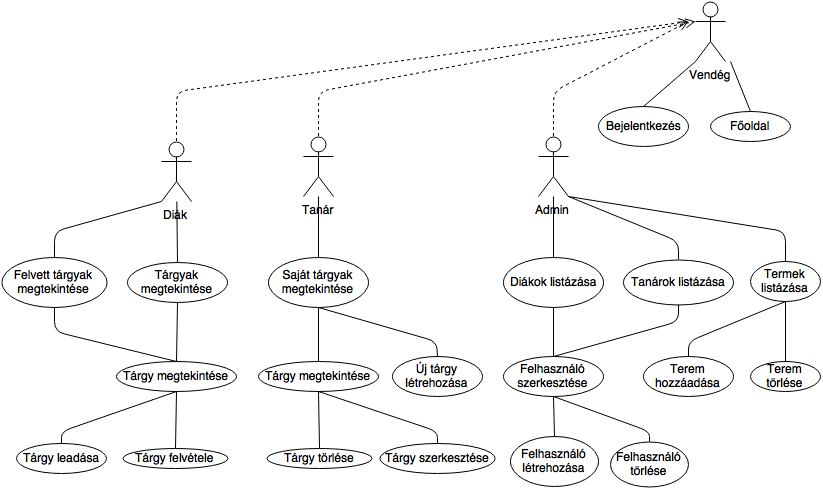
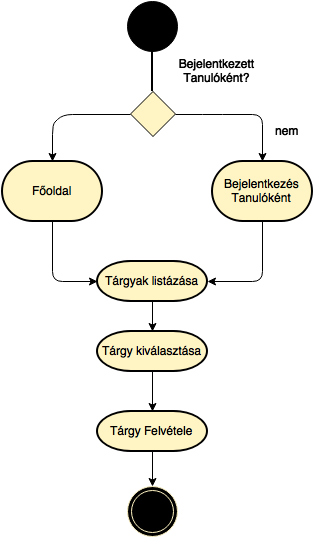
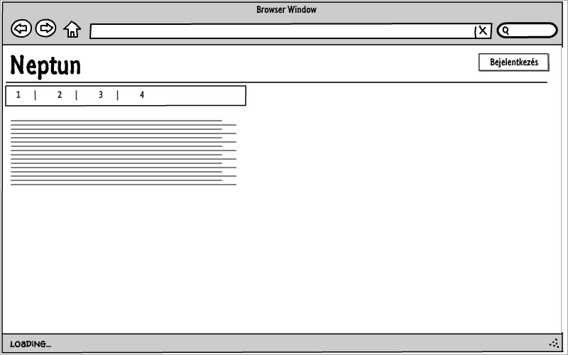
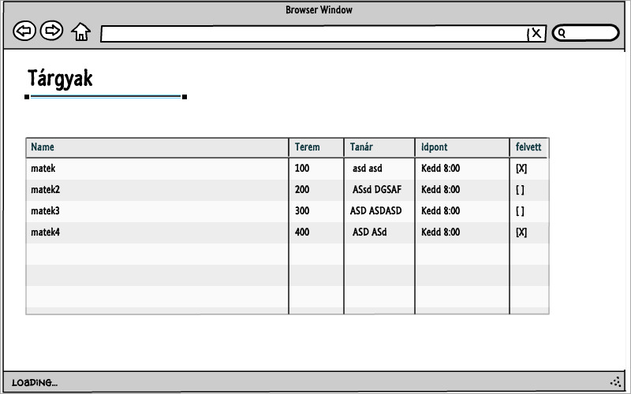
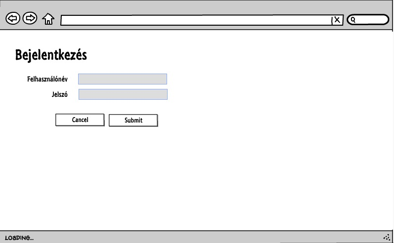
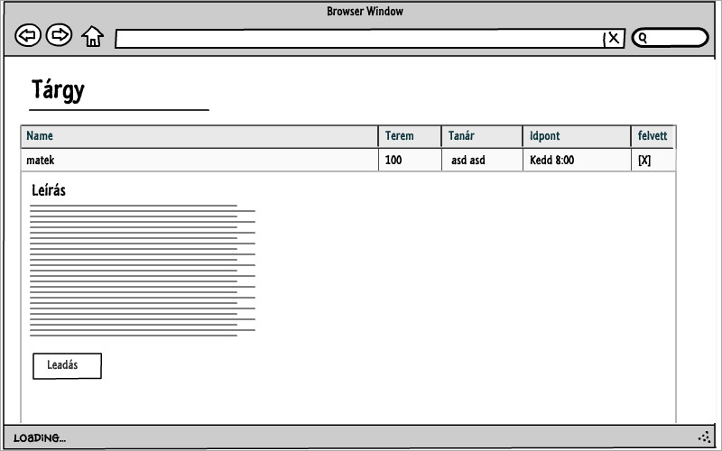
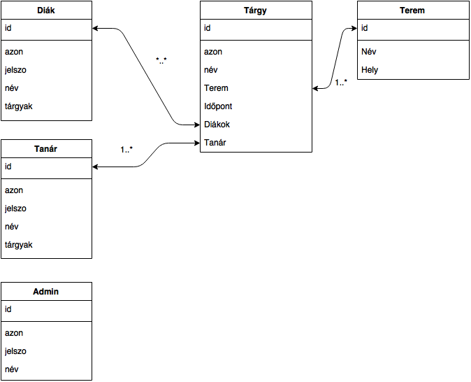

# Dokumentáció
# Neptun    
Naddaf Sharif Alexander     
GU5I9D  
#1.Követelményanalízis  
##1.1. Célkituzés, projektindító dokumentum     
Cél egy olyan weboldal készítése, ahol a tanulók tárgyakat tudnak felvenni és leadni, a tanárok új tárgyakat írhatnak ki és saját tárgyaikat szerkeszhetik, ezt mind az admin felügyeletével.       

######Funkcionális követelmények:  
* Bejelentkezés
* Csak bejelentkezett felhasználók által elérheto funkciók:      
    - Tanárok számára:    
    -- Saját tárgy lérehozása   
    -- Saját tárgy törlése  
    -- Saját tárgy szerkesztése        
    - Diákok számára:    
    -- Tárgy felvétele  
    -- Tárgy leadása     
    - Admin számára     
    -- Tanár felhasználó létrehozása/törlése    
    -- Diák felhasználó létrehozása/törlése     
    -- Terem létrehozása/törlése        

######Nem funkcionális követelmények:
*	**Könnyu áttekinthetoség:** Színekkel típus szerint csoportosítás
*	**Használhatóság:** Könnyu áttekinthetoség, ésszeru elrendezés, könnyen kezelhetoség
*	**Megbízhatóság:** jelszóval védett funkciók, és a jelszavak védelme a háttérben. Hibásan bevitt adatok esetén a program jól láthatóan jelezzen a felhasználónak, és emelje ki a hibás beviteli mezoket. A jól bevitt adatok maradjanak az urlapban.
*	**Karbantarthatóság:** könnyen lehessen bovíteni, a különbözo típusú fájlok külön csoportosítva, ésszeruen legyenek felbontva, a könnyebb fejleszthetoség miatt

##1.2.	Használatieset-modell, funkcionális követelmények

**Vendég**: Csak a publikus oldalakat éri el
*	Fooldal
*	Bejelentkezés

**Bejelentkezett Tanár**:       
*	Új Tárgy létrehozása
*	Saját Tárgy törlése/szerkesztése       

**Bejelentkezett Tanuló**:     
*	Tárgy felvétele
*	Felvett tárgy leadása  

**Bejelentkezett Admin**:  
*	Tanár/Tanuló felhasználó létrehozása
*	Meglévo Tanár/Tanuló törlése/szerkesztése
*	Terem létrehozása
*	Meglévo terem törlése/szerkesztése

**Meglévo recept szerkesztése:**

1.	A felhasználó az oldalra érkezve, bejelentkezik Tanulóként
2.	Bejelentkezés után listázhatja a Tárgyakat.
3.	Kiválaszt egy Tárgyat
4.	Az adott tárgynál rányom a felvétel gombra

#2.	Tervezés

##2.1.	Architektúra terv

####2.1.1. Oldaltérkép

**Publikus:**
* Fooldal
* Bejelentkezés

**Bejelentkezett:**
* Fooldal(Tanár,Tanuló,Admin)
* Tárgyak listázása(Tanuló,Admin)
   * Tárgy Kiválasztása(Tanuló,Admin)
        * Tárgy Felvétele/Leadása(Tanulü)
        * Tárgy Törlése/Szerkesztése(Admin)
* Saját Tárgyak listázása(Tanuló,Tanár)
    * Tárgy kiválasztása(Tanuló,Tanár)
        * Tárgy létrehozása/törlése/szerkesztése(Tanár)
        * Tárgy felvélte/leadása(Tanuló)
* Tanulók/Tanárok Listázása(Admin)
  * Felhasználó kiválasztása
    * Felhasználó Szerkesztése/Törlése
  * Felhasználó létrehozása 
 
######2.1.3. Végpontok

* GET/: fooldal
* GET/login: bejelentkezo oldal
* POST/login: bejelentkezo adatok felküldése
* GET/logout: kijelentkezo oldal
* GET/targy/lista: tárgylista oldal
* GET/targy/uj: új tárgy létrehozasa
* POST/targy/uj: új tárgy felvételéhez szükséges adatok felküldése
* GET/targy/azon: targy adatok
* GET/targy/torles=azon: tárgy törlése
* GET/targy/szerk=azon: tárgy módosítása
* POST/targy/szerk=azon: tárgy módosítása, adatok felküldése
* GET/felh/lista: felhasználólista oldal
* GET/felh/uj: új felhasználó létrehozása
* POST/felh/uj: új felhasználó létrehozásához szükséges adatok felküldése
* GET/felh/azon: felhasználó adatok
* GET/felh/torles=azon: felhasználó törlése
* GET/felh/szerk=azon: felhasználó módosítása
* POST/felh/szerk=azon: felhasználó módosítása, adatok felküldése
* GET/terem/lista: teremlista oldal
* GET/terem/uj: új terem létrehozása
* POST/terem/uj: új terem létrehozásához szükséges adatok felküldése
* GET/terem/azon: terem adatok
* GET/terem/torles=azon: terem törlése
* GET/terem/szerk=azon: terem módosítása
* POST/terem/szerk=azon: terem módosítása, adatok felküldése

#####2.2. Felhasználói-felület modell

######2.2.1.Oldalvázlatok:

**Fooldal**

**tárgyak oldal**

**Bejelentkezo oldal**

**Tárgy oldal**

 **Adatmodell és Adatbázisterv**
 
 
 

