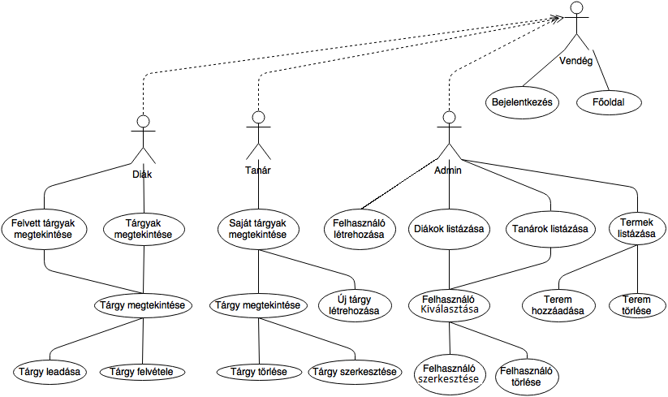

# Dokumentáció
## Neptun    
Naddaf Sharif Alexander     
GU5I9D  
#1.Követelményanalízis  
##1.1. Célkituzés, projektindító dokumentum     
Olyan weboldal készítése, ahol a tanulók tárgyakat vehetnek fel és a tanár új tárgyakat írhatnak ki.       

######Funkcionális követelmények:  
* Bejelentkezés
* Csak bejelentkezett felhasználók által elérheto funkciók:      
    - Tanárok számára:    
    -- Saját tárgy lérehozása   
    -- Saját tárgy törlése  
    -- Saját tárgy szerkesztése        
    - Diákok számára:    
    -- Tárgy felvétele  
    -- Tárgy leadása     
    - Admin számára     
    -- Tanár felhasználó létrehozása/törlése    
    -- Diák felhasználó létrehozása/törlése     
    -- Terem létrehozása/törlése        

######Nem funkcionális követelmények:
*	**Könnyu áttekinthetoség:** Színekkel típus szerint csoportosítás
*	**Használhatóság:** Könnyu áttekinthetoség, ésszeru elrendezés, könnyen kezelhetoség
*	**Megbízhatóság:** jelszóval védett funkciók, és a jelszavak védelme a háttérben. Hibásan bevitt adatok esetén a program jól láthatóan jelezzen a felhasználónak, és emelje ki a hibás beviteli mezoket. A jól bevitt adatok maradjanak az urlapban.
*	**Karbantarthatóság:** könnyen lehessen bovíteni, a különbözo típusú fájlok külön csoportosítva, ésszeruen legyenek felbontva, a könnyebb fejleszthetoség miatt

##1.2.	Használatieset-modell, funkcionális követelmények

**Vendég**: Csak a publikus oldalakat éri el
*	Fooldal
*	Bejelentkezés

**Bejelentkezett Tanár**:       
*	Új Tárgy létrehozása
*	Saját Tárgy törlése/szerkesztése       

**Bejelentkezett Tanuló**:     
*	Tárgy felvétele
*	Felvett tárgy leadása  

**Bejelentkezett Admin**:  
*	Tanár/Tanuló felhasználó létrehozása
*	Meglévo Tanár/Tanuló törlése/szerkesztése
*	Terem létrehozása
*	Meglévo terem törlése/szerkesztése

